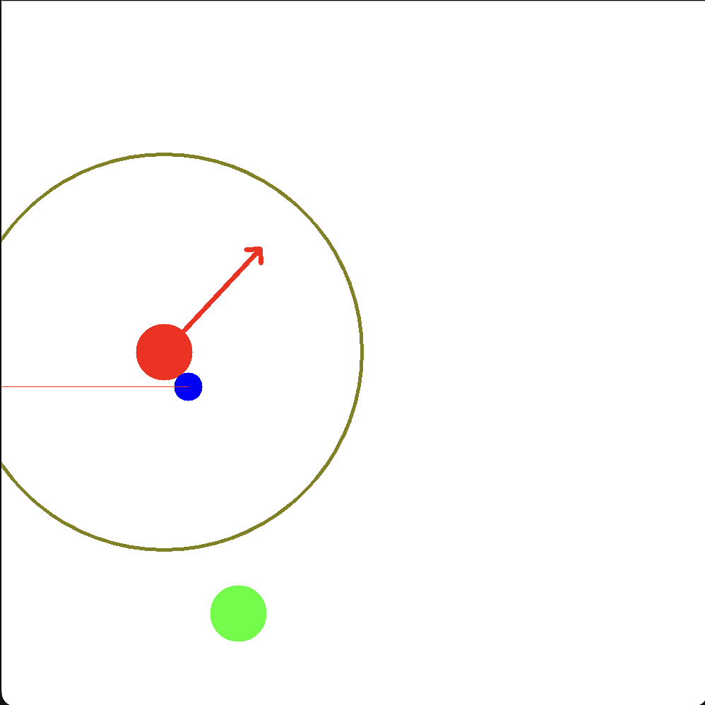

# Mapless Transportation

The task of Mapless Transportation via pushing is defined as:

A robot must push an object towards a goal position without colliding with the obtacles.

Robot:
- Holonomic on the 2D plane.
- 2D Laser range finder.
- Does not have a map of the environment.
- Knows at all times the position of the goal.

## Reinforcement Learning

We will solve the task using Reinforcement Learning.

Chosen algorithm: PPO.

Agent:
- Shape: Circle of radius 1.
- Actions:
    - Holonomic: 8 possible directions with fixed length.   
        - North, Northeast, East, Southeast, South, Southwest, West, Northwest.
        - Fixed length: 1.

Observation:
- 24 laser beams with range. 
    - Normalized [0, 1].
    - If no obstacle detected: default value of 1.
- Polar coordinates of the goal.
- pOlar coordinates of the object.

### Reward shaping

Base reward:
- Time penalty: given at every step.
- Death penalty: 
    - Given when the agent or the object collides with an obstacle.
    - Given when the agent goes further than a certain distance from the object.
- Success reward.

#### Should we add a progress reward?
Progress reward: How much has the distance from object to goal reduced after an action?

## Obstacle configuration
The agent will be trained on different obstacle configurations (maps).
We should have novel maps for evaluation.

As the agent only has access to local information, the maps should be solvable by a greedy algorithm.
No backtraking required?

### Training set:

#### Sparse

### Eval set: